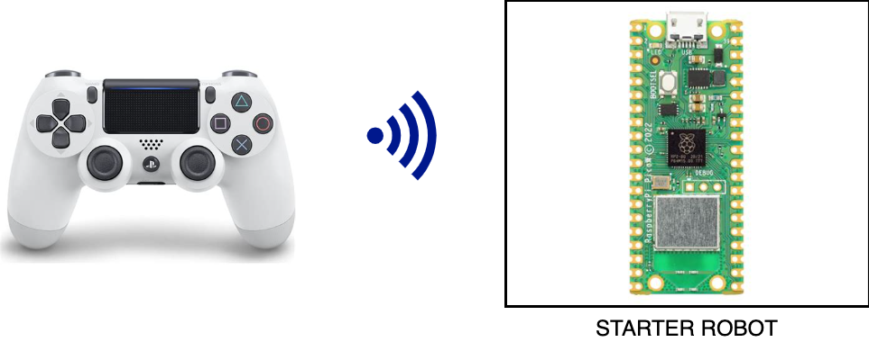
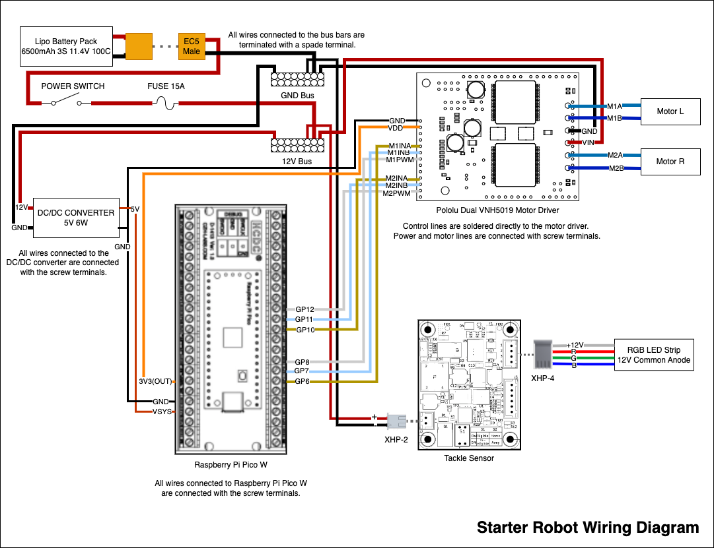

# CRFC Starter Robot Platform

## Overview

This firmware repository supports the Raspberry Pi Pico W and the Playstation Dualshock 4 controller.



## Pre-Requisites

### Windows & Linux

Install Windows Subsystem for Linux (wsl). The instructions for installing WSL are here: [WSL](https://learn.microsoft.com/en-us/windows/wsl/install).

In Windows launch WSL or in Linux launch a terminal.  

Run the following commands to install the necessary prerequisites.

```bash
sudo apt install git cmake gcc-arm-none-eabi libnewlib-arm-none-eabi libstdc++-arm-none-eabi-newlib
```

### MacOS

Install homebrew.  Go to the homebrew [website](https://brew.sh/) and run the install command.

Launch the terminal an use homebrew to install the build tools

```bash
brew install zstd
brew install cmake
brew install --cask gcc-arm-embedded
```

## Project Setup

Clone the repo:

```bash
git clone https://github.com/ehunck/crfc-starter-robot.git
```

or use SSH

```bash
git clone git@github.com:ehunck/crfc-starter-robot.git
```

Update all of the submodules (This pulls in the pico-sdk.)

```bash
git submodule update --init --recursive
```

This repository was setup by following the instructions here:

https://www.raspberrypi.com/documentation/microcontrollers/c_sdk.html#quick-start-your-own-project

## Build the Project

```bash
mkdir build
cd build
cmake -DPICO_BOARD=pico_w -DPICO_SDK_PATH=../pico-sdk ../
cmake --build .
```

## Flash the Firmware

You now have `main_app.elf` to load via a debugger, or `main_app.uf2` that can be installed and run on your Raspberry Pi Pico via drag and drop.

To upload via USB, hold down the BOOTSEL button while plugging it in. This will mount a device called RPI-RP2 to copy your UF2 file into. See
https://www.raspberrypi.com/documentation/microcontrollers/raspberry-pi-pico.html for more detailed instructions on managing the device.

## Develop with VSCode

This is optional, but VSCode can be used to edit and build the project.

Install `CMake Tools` Extension from Microsoft.

Run `>CMake: Configure` to setup the project to build.
Select the toolchain which should be `gcc-arm-none-eabi`.  

Run `>CMake: Build Target` to select the build target.
Select the target which should be `main_app`.

## Hardware

The pinout for the robot motor driver can be found in the `pin_definitions.h`. Here is the latest.

```c
// LEFT MOTOR DRIVER
#define PIN_LEFT_MOTOR_INA  6   // GPO
#define PIN_LEFT_MOTOR_INB  7   // GPO
#define PIN_LEFT_MOTOR_PWM  8   // PWM4 A 

// RIGHT MOTOR DRIVER
#define PIN_RIGHT_MOTOR_INA 10  // GPO
#define PIN_RIGHT_MOTOR_INB 11  // GPO
#define PIN_RIGHT_MOTOR_PWM 12  // PWM6 A 
```

The wiring diagram can be seen below.



After powering on the robot, the LED on the pico-w will be flashing.  This indicates that the controller is not connected.

Simultaneously press and hold the Playstation Center Button and the Share Button.  The controller will go into the fast flashing mode.  Once the pico-w finds the controller, it's LED will go solid.

## Contributing

You can fork this porject and use it as a start for your own robot platforms.

If you make improvements to this, feel free to open an issue and submit a pull request!  The maintainers will be happy to accept these contributions and merge your changes in to the repo as long as the functionality doesn't break the existing functionality.

"Knock-off" Dual Shock 4 PS4 controllers may or may not work with this project.  Right now, only "official" controllers are supported.  Contributions related to supporting alternative "knock-off" controllers will be accepted so long as they don't break compatibility with the existing supported controllers.

If you find a bug, please open an issue to report it! The more detail the better. Help us find the solution as well!

### New Features Not Yet Implemented

- Simple settings storage for things like calibration and tuning values.
- Store the remote address string of the controller in the settings to allow the robot to automatically connect on startup.
- Add PWM servo output control that maps to the triggers on the controller.  These can be used as auxiliary actuators.
