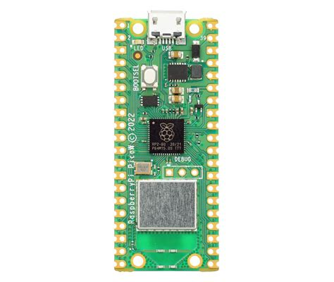

# CRFC Starter Robot Platform

## Overview

This firmware repository supports the Raspberry Pi Pico W and the Playstation Dualshock 4 controller.




## Pre-Requisites

### Windows & Linux

Install Windows Subsystem for Linux (wsl).

Launch WSL and install the following:

```bash
sudo apt install git cmake gcc-arm-none-eabi libnewlib-arm-none-eabi libstdc++-arm-none-eabi-newlib
```

### MacOS

Install homebrew.

Launch the terminal an use homebrew to install the build tools

```bash
brew install zstd
brew install cmake
brew install --cask gcc-arm-embedded
```

## Project Setup

Clone the repo:

```bash
git clone https://github.com/ehunck/crfc-starter-robot.git
```

or use SSH

```bash
git clone git@github.com:ehunck/crfc-starter-robot.git
```

Update all of the submodules (This pulls in the pico-sdk.)

```bash
git submodule update --init --recursive
```

This repository was setup by following the instructions here:

https://www.raspberrypi.com/documentation/microcontrollers/c_sdk.html#quick-start-your-own-project

Install Prerequisites:

....

## Build the Project

```bash
mkdir build
cd build
cmake -DPICO_BOARD=pico_w -DPICO_SDK_PATH=../pico-sdk ../
cmake --build .
```

## Flash the Firmware

You now have `main_app.elf` to load via a debugger, or `main_app.uf2` that can be installed and run on your Raspberry Pi Pico via drag and drop.

## Develop with VSCode

This is optional, but VSCode can be used to edit and build the project.

Install `CMake Tools` Extension from Microsoft.

Run `>CMake: Configure` to setup the project to build.
Select the toolchain which should be `gcc-arm-none-eabi`.  

Run `>CMake: Build Target` to select the build target.
Select the target which should be `main_app`.


## Hardware

The pinout for the robot motor driver can be found in the `pin_definitions.h`. Here is the latest.

```c
// LEFT MOTOR DRIVER
#define PIN_LEFT_MOTOR_INA  6   // GPO
#define PIN_LEFT_MOTOR_INB  7   // GPO
#define PIN_LEFT_MOTOR_PWM  8   // PWM4 A 

// RIGHT MOTOR DRIVER
#define PIN_RIGHT_MOTOR_INA 10  // GPO
#define PIN_RIGHT_MOTOR_INB 11  // GPO
#define PIN_RIGHT_MOTOR_PWM 12  // PWM6 A 
```

After powering on the robot, the LED on the pico-w will be flashing.  This indicates that the controller is not connected.

Simultaneously press and hold the Playstation Center Button and the Share Button.  The controller will go into the fast flashing mode.  Once the pico-w finds the controller, it's LED will go solid.
